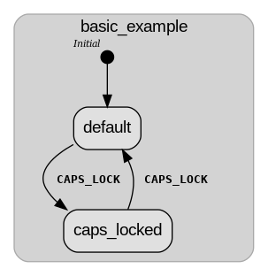
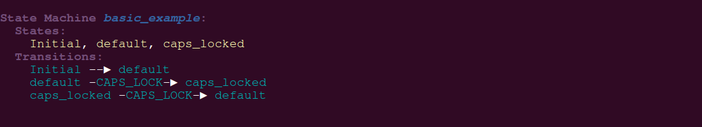
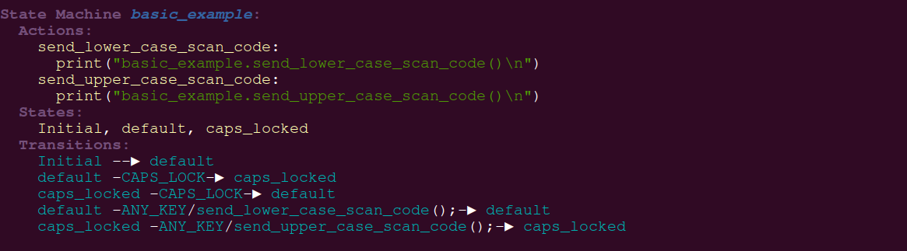
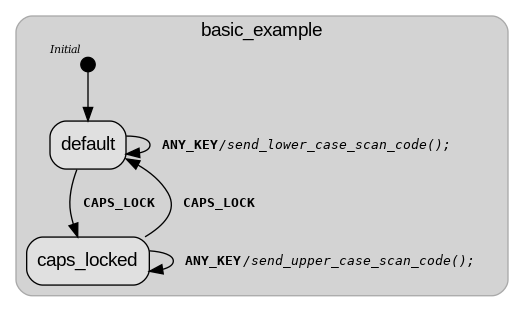
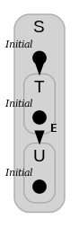
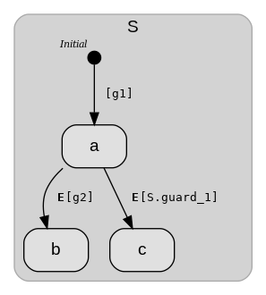
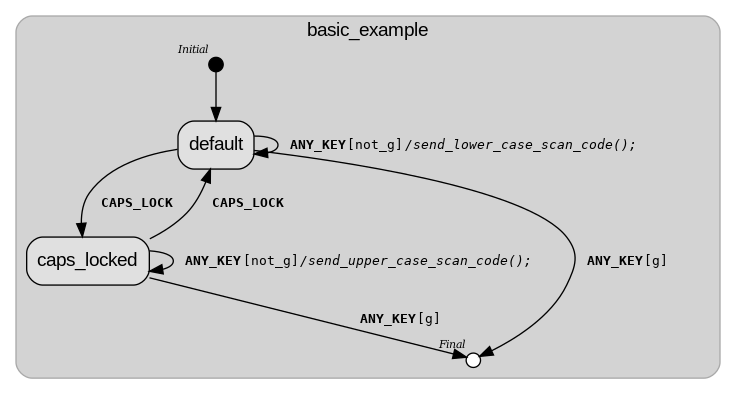
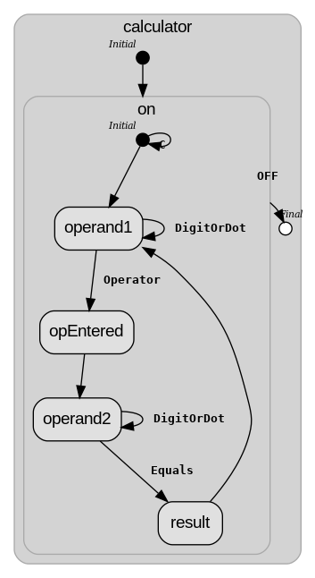

# machines4ceps
__Write, run, visualize__, and __trace__ complex __state machines__ (__UML__ statecharts, __Harel__ statecharts, state diagrams).

## Features (machines4ceps as found in the standard distribution of the ceps tool)

- UML 2.5 state charts (and more).
- Concise notation.
- Guards, Events, Actions etc.
- Simulation.
- Computation of State/Transition Coverage.
- Any input format supported, i.e. write your state machine as you see fit and use ceps' built-in language engine to map it into machines4ceps representation.  
- Any output format supported, the very same language engine allows you to export your state machine into any imaginable format by adding simple transformation rules.
- Supports WebSocket, Bosch-CAN.
- Runs on any Unixish device.

## Installation

Details can be found [here](./INSTALL.md)  

## Background: ceps - making software the reverse way (Gives a broader perspective - skip if you couldn't care less)

Machines4ceps is part of the ceps tool. The name ceps is derived from the word 'spec' - the abbreviation of specification - spelled backwards. 
Ceps is pronounced like the word 'caps' which is (almost) the phonetical reverse of spec.

### Software is about computational processes.

*Computational processes* 'live' in machines and are therefore physical by their very nature.
Source code shapes computational processes but inhabits a differnt place: our minds.
Computational processes are truely infinite, source code is a finite thing.

We choose the word 'shape' to express the fact of an unbridgeable semantic gap between the
description of a computation and its materialization in the physical world.

With the advent of differentiable programs, quantum computing and others, software will become
even more shaped and less 'programmed'.

Obviously the degree to which source code shapes a computational process varies.

A program written in x86 Assembler targeted for an 8088 with 256KB RAM and 512KB disk storage
gives a pretty good idea of the actual process' behaviour resulting from
executing the program's instructions, i.e. the x86 assembler program describes the
corresponding computational process with a relatively high degree of accuracy.

The very same program executed on an i14900K with 8 Performance and 16 Efficiency cores,
hyperthreading, out of order execution, branch prediction and a cache architecture
more complicated than anything a processor designer in the 90s could ever dream of,
gives rise to a completely different beast.

And yet we think of both as being the 'same' thing. The degree of 'semantical overlap',
or the error margin introduced by ignoring the complexities of the different machines
executing the same code could be indeed acceptable in this case.
Traditional methods of 'thinking about programs' assume that there is a simple and linear
relation between code and computation.

Way more dramatic is the situation if we look at software like a mobile app for
stock trading. This is a highly distributed program relying on cloud based services and
running on a mind bending variety of interconnected hardware giving rise to an universe of
computational processes. This thing is hardly to be understood by looking at a couple of
JavaScript statements alone.

And yet the stock trading mobile app is treated by software engineers, at least conceptually,
very much like the easy to grasp x86 code from before.

Looking at code, analyzing code, feeding code to whatever fancy method imaginable cannot
and will not provide the insight necessary to make the computational process bend
to our will.

We need to look at the computational process itself.

That's what ceps is about: Shifting the focus of attention from the code to the actual computation.

Machines4ceps is, like the very word suggests, the part of ceps which is concerned with **machines**, the
other (built-in) part of ceps is **language**.

## Writing, running, and rendering state machines - Quick Start

This intro follows closely the discussion in https://en.wikipedia.org/wiki/UML_state_machine. 

### A basic state machine

*Source:Wikipedia*

#### __A basic state machine__: Notation

Here comes our very first version of the depicted state machine:  

```bash
kind Event;

Event CAPS_LOCK, ANY_KEY;

sm{
 basic_example;
 
 states{Initial; default; caps_locked;};

 t{Initial;default;}; 
 t{default;caps_locked;CAPS_LOCK;};
 t{caps_locked;default;CAPS_LOCK;}; 
};
```
The notation is a bit clumsy but readable. The code can be found in __examples/first_steps/basic_uml_state_diagram.ceps__.

Yes, *machines4ceps* is all about **coding** state machines, the drawing is - or at least should be - done by algorithms (see the section on drawing state machines). This approach has two major benefits:
- it scales, a purely graphical approach isn't feasible if your system has thousands of states.
- it is compatible with the established methods and tools we use to write software in general.

#### __A basic state machine__: Execution (Part I)

One way to understand what a state machine is doing is to run a *simulation*. Simulating state machines is a key feature of *machines4ceps*.
To get our example running the only thing we need to add is a *Simulation* directive including a *Start* directive with the names of the state machines we want to run:
```C
Simulation{
 Start{basic_example;};
 };
```
To run this example, open a shell/terminal, change your working directory to the *machines4ceps* repo, and type:
* __cd__ examples/first_steps
* ../../bin/__ceps__ basic_uml_state_diagram.ceps simulation_1.ceps

After executing the last command, you should get the following output:

```Pascal

basic_example.Initial- basic_example.default+

```

The meaning of which is, that the machine __basic_example__ made a single transition from the initial state *Initial* to the state *default*. 

#### __A basic state machine__: Execution (Part II)

Let's fire three __CAPS_LOCK__ events and look how the state machine behaves.

```Pascal
Simulation{
 Start{basic_example;};
 
 CAPS_LOCK;
 CAPS_LOCK;
 CAPS_LOCK;
 };
```

To run this simulation, open a shell and type (assuming your working directory is machines4ceps/examples/first_steps):
* ../../bin/__ceps__ basic_uml_state_diagram.ceps simulation_2.ceps

This should produce the following output:
```Pascal
basic_example.Initial- basic_example.default+
basic_example.default- basic_example.caps_locked+
basic_example.default+ basic_example.caps_locked- 
basic_example.default- basic_example.caps_locked+
```

The default behaviour of __ceps__ is approximately as follows: fetch an event, process all transitions triggered by that event, report the set of affected states, and repeat. If we run our simulation inside a terminal window, __ceps__ will report the set of changed states by simply printing the name of each state followed by a __+__ or __-__, indicating whether the state is active or not (this notation was introduced by Arne Kirchhoff). Each iteration produces one line of output.  We have three events in our last simulation, but four lines of output.That's because of the transition __t{Initial;default;};__ which has no associated event and is therefore triggered simply by starting the state machine (epsilon transition).

### Visualization using mermaid.js

More information on that is found [here](https://github.com/cepsdev/mermaid)

### Visualization (The *--dot_gen* option)

The following requires *graphviz* to be installed on your machine (see https://graphviz.org).

With the option __--dot_gen__ set, __ceps__ writes a *dot* representation of all top level state machines into the file __out.dot__.

The commands

* ../../bin/ceps basic_uml_state_diagram.ceps --dot_gen
* dot -Tpng out.dot -o img/basic_uml_state_diagram.png

produce the following graphical representation of the state machine __basic_example__.



### Visualization (The *--pr* option)

Another possibility, which requires nothing else than a shell, offers the *--pr* option. It outputs a python like representation on stdout.

The commands

* ../../bin/ceps basic_uml_state_diagram.ceps --pr

produce the following output on the console:




### Completing the basic example: Adding Actions

We complete the ceps version of the basic state machine, by adding the missing transitions under the __ANY_KEY__ event together with the associated actions.

```javascript
kind Event;

Event CAPS_LOCK, ANY_KEY;

sm{
 basic_example;
 states{Initial; default; caps_locked;};

Actions{
  send_lower_case_scan_code {print("basic_example.send_lower_case_scan_code()\n");};
  send_upper_case_scan_code{print("basic_example.send_upper_case_scan_code()\n");};
 };

 t{Initial;default;};
 t{default;caps_locked;CAPS_LOCK;};
 t{caps_locked;default;CAPS_LOCK;};

 t{default;default;ANY_KEY;send_lower_case_scan_code;};
 t{caps_locked;caps_locked;ANY_KEY;send_upper_case_scan_code;};
};

```




The code can be found in __examples/first_steps/basic_uml_state_diagram_with_actions.ceps__.


The extended version works perfectly fine with our simulations (*simulation_1.ceps* and *simulation_2.ceps*) developed so far, and exhibits exactly the same behaviour as our previous version under the current set of simulations. To get a somehow different behaviour, we need to trigger at least one __ANY_KEY__ transition. That's done
by adding a couple of __ANY_KEY__ events to our simulation.

```javascript
Simulation{
 Start{basic_example;};

 ANY_KEY;
 CAPS_LOCK;
 ANY_KEY;
 CAPS_LOCK;
 ANY_KEY;

 };
```
The code can be found in __examples/first_steps/simulation_3.ceps__.

If we run 

* ../../bin/ceps basic_uml_state_diagram_with_actions.ceps simulation_3.ceps

we get the following output.

```javascript
basic_example.Initial- basic_example.default+ 
basic_example.send_lower_case_scan_code()
basic_example.default- basic_example.caps_locked+ 
basic_example.send_upper_case_scan_code()
basic_example.default+ basic_example.caps_locked- 
basic_example.send_lower_case_scan_code()
```
## Communication via WebSockets

One of the supported protocols is __WebSocket__ (https://en.wikipedia.org/wiki/WebSocket). 

### The option --ws_api PORT

The option *--ws_api PORT*, where port is a 16 bit unsigned integer, will start ceps as a *WebSocket* server listening on port *PORT*. This allows us to send and receive events, set values etc. remotely via the WebSocket API.

### Running the basic example as a WebSocket server

Run 

```bash
 ../../bin/ceps basic_uml_state_diagram_with_actions.ceps empty_simulation.ceps --ws_api 3001
```
Open a second shell/terminal, and run websocat (https://github.com/vi/websocat):

```bash
 websocat ws://localhost:3001
```

If you type 

```bash
 EVENT CAPS_LOCK
```

You should observe a transition to the state __basic_example.caps_locked__, i.e the shell running the state machine should produce the output

```bash
basic_example.default- basic_example.caps_locked+ 
```


## Extended States and guards

### Extended States

State machines combined with variables holding values, like integers, strings etc., are called __extended state machines__ (see https://en.wikipedia.org/wiki/UML_state_machine#Extended_states). We call extended states *Systemstate*.
Extended states are introduced, or declared, using the notation

__Systemstate__ *variable_name*;


```javascript


kind Event;
kind Systemstate;

Systemstate key_count;

Event CAPS_LOCK, 
      ANY_KEY;


sm{
 basic_example;

 states{Initial; 
        default; 
        caps_locked;};
 
 on_enter{
     key_count = 10;
 };
 
 Actions{
  send_lower_case_scan_code {
     key_count = key_count - 1; 
     print("key_count=",key_count,"\n");
  };
  send_upper_case_scan_code{
     key_count = key_count - 1;
     print("key_count=",key_count,"\n");
  };
 };
 
 t{Initial; default;};
 t{default; caps_locked; CAPS_LOCK;};
 t{caps_locked; default; CAPS_LOCK;};

 t{default; default; ANY_KEY; send_lower_case_scan_code;}; 
 t{caps_locked; caps_locked; ANY_KEY; send_upper_case_scan_code;};
};

```
The code can be found in __examples/first_steps/extended_uml_state_diagram_with_actions.ceps__.

To run this example, open a shell/terminal, change your working directory to the *machines4ceps* repo, and type:
* __cd__ examples/first_steps
* ../../bin/__ceps__ extended_uml_state_diagram_with_actions.ceps simulation_3.ceps 

This will generate the following output:

```bash

basic_example.Initial- basic_example.default+ 
key_count=9
basic_example.default- basic_example.caps_locked+ 
key_count=8
basic_example.default+ basic_example.caps_locked- 
key_count=7


```

### Setting up preconditions/ensuring invariants: *on_enter*

#### Some definitions
*(skip this if you are not into details)*

In order to give a sufficiently precise explanation of *on_enter* we need a couple of
more fundamental definitions first. 

The single most important structure, when it comes to the execution of a state machine, is the *active states set*. 

A state is __active__ exactly if it is in the *active states set* or *ASS*, a state is *inactive* if it is not active, 
i.e. not a member of the *active states set*. The *ASS* is intially empty, a command like 
__Start{__*NameOfStateMachine*__;};__ puts, conceptually speaking, the state referred to by *NameOfStateMachine* in the *active states set*. 
Yes, a state machine is a state. States with an inner structure - like state machines - are called __composite states__. 

If an inactive state becomes active, i.e. a state which is not in the *ASS* being put into the *ASS*, we say the state is being __entered__. A state is being __visited__ if it is added to the *ASS*, this includes the case of the state being already in the *ASS*. A state being *entered* is also *visited*, but you can visit a state without entering it.  

A state machine is *started* by entering it, e.g. the previously mentioned __Start{__*NameOfStateMachine*__};__ command enters the (composite) state referred to by *NameOfStateMachine*. 

Another important notion is the __set of active transitions__  __SAT(s,E)__ . This is - roughly - the set of all transitions of the form  t{s;.;E;...}; for a state __s__ and an event __E__. 

#### Execution of a state machine  
*(skip this if you are not into details)*

Conceptually the execution of a state machine follows the following schema - very approximate :

* While *ASS* is not empty do
   * Fetch an event E
   * *L* := [] 
   * for each state s in *ASS* do
     * for each transition t{s,s',E,actions,guards} in *SAT(s,E)* with at least one true g in guards do
         * L += [s']
         * Run each action in *actions*
         * if s' is not in *ASS* call *s'.on_enter*   (A)
   * OLD_ASS = ASS
   * N = set of all s in OLD_ASS with no transition under E
   * ASS = L + N
   * Exited := OLD_ASS - ASS
   * for each state s in Exited do
     * call s.on_exit  (B)

Especially steps (A) and (B) don't tell the whole truth.

#### on_enter, on_exit

A state machine can define a special action *on_enter* which is called when the state machine is entered, i.e visted the very first time.
The purpose of *on_enter* is the same as that of contructors in C++: to setup invariants.
In the case a state machines is exited a potential *on_exit* routine is called.

__Example:__

```javascript
kind Event;
kind Systemstate;

Event E;

sm {
 S;
 on_enter{
  print("S.on_enter()\n");
 };
 
 sm{
   T;
   on_enter{
    print("T.on_enter()\n");
   };
   on_exit{
    print("T.on_exit()\n");
   };
   states{Initial;};
 };

 sm {
  U;
  on_enter{
   print("U.on_enter()\n");
  };
  states {Initial;};
 };
 
 states{Initial;};
 t{Initial;T;};
 t{T;U;E;};
};

Simulation{
 Start{S;};
 E;
};

```



The code can be found in __examples/first_steps/exit_enter_handlers.ceps__.

To run this example, open a shell/terminal, change your working directory to the *machines4ceps* repo, and type:
* __cd__ examples/first_steps
* ../../bin/__ceps__ exit_enter_handlers.ceps

Output is:

```bash
S.on_enter()
T.on_enter()
S.Initial- S.T+ S.T.Initial+ 
T.on_exit()
U.on_enter()
S.T- S.T.Initial- S.U+ S.U.Initial+ 
```


### Guards

```javascript

kind Event;
kind Systemstate;
kind Guard;


Guard g1,g2;

g1 = 1 < 2;
g2 = 1 > 2;

Event E;

sm{
 S;
 states{Initial;a;b;c;};
 t{Initial;a;g1;};
 t{a;b;E;g2;};
 t{a;c;E;!g2;};
};

Simulation{
 Start{S;};
 E;
};

```



Output:

```javascript
S.Initial- S.a+ inalizing 
S.a- S.c+ 
```

### Finalizing the introductory example


```javascript
kind Event;
kind Systemstate;
kind Guard;


Event CAPS_LOCK,
      ANY_KEY;
Systemstate key_count;

Guard g,not_g;
g = key_count == 0;  
not_g = !g;

sm{
 basic_example;

 states{Initial;
        default;
        caps_locked;
        Final;};

 on_enter{
     key_count = 10;
 };

 Actions{
  send_lower_case_scan_code {
     key_count = key_count - 1;
     print("key_count=",key_count,"\n");
  };
  send_upper_case_scan_code{
     key_count = key_count - 1;
     print("key_count=",key_count,"\n");
  };
 };

 t{Initial; default;};
 t{default; caps_locked; CAPS_LOCK;};
 t{caps_locked; default; CAPS_LOCK;};
 t{default;Final;ANY_KEY;g;};
 t{caps_locked;Final;ANY_KEY;g;};
 t{default; default; ANY_KEY;not_g; send_lower_case_scan_code;};
 t{caps_locked; caps_locked; ANY_KEY;not_g; send_upper_case_scan_code;};
};


```





### A Calculator


```javascript
kind Event;
kind Systemstate;
kind Guard;


Event DigitOrDot, Equals, Operator, C, OFF;

sm{
 calculator;
 states{Initial;Final;};
 sm{
  on;
  on_enter{
   print("on.on_enter()\n");
  };
  states{operand1;opEntered;operand2;result;Initial;};

  t{Initial;operand1;};
  t{operand1;operand1;DigitOrDot;};
  t{operand1;opEntered;Operator;};
  t{opEntered;operand2;};
  t{operand2;operand2;DigitOrDot;};
  t{operand2;result;Equals;};
  t{result;operand1;};
 };

 t{Initial;on;};
 t{on;on;C;};
 t{on;Final;OFF;};
};


Simulation{
 Start{calculator;};
 DigitOrDot;
 DigitOrDot;
 Operator;
 C;
 DigitOrDot;
 OFF;
};
```
Source in __examples/first_steps/calculator.ceps__.

Output:


```javascript
on.on_enter()
calculator.Initial- calculator.on+ calculator.on.Initial+ 
calculator.on.operand1+ calculator.on.Initial- 
calculator.on.operand1- calculator.on.opEntered+ 
calculator.on.opEntered- calculator.on.operand2+ 
calculator.Final+ calculator.on- calculator.on.operand2-
```





