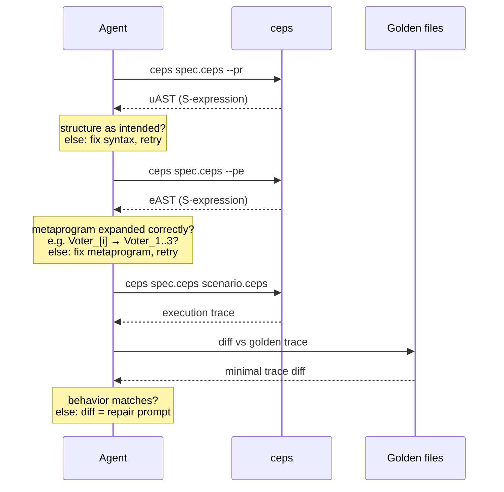

# ceps - the tool for spec driven AI 

[Skill File (also a good introduction for humans)](./SKILL.md)

## Features (machines4ceps as found in the standard distribution of the ceps tool)

Look [here](./FEATURES.md) for a list of features.

## Installation

Details can be found [here](./INSTALL.md)  

## Writing, running, and rendering state machines - Quick Start

Look [here](./QUICK-START-UML-WITH-CEPS.md) if you are interested mainly in using ceps' UML state charts features.

# Spec-Driven AI Coding Loop with ceps

A tool-agnostic blueprint for using **ceps** executable specifications as the
ground truth in an AI-assisted development loop. Works with any CI system
(GitHub Actions, GitLab CI, Jenkins, plain `make`) and any coding agent.

---

## Introduction: Why Spec-Driven AI Coding Is Hard — and How This Pipeline Helps

### The promise

Spec-driven AI coding inverts the usual workflow: instead of prompting an
agent with ad-hoc instructions and reviewing whatever comes back, you fix a
*specification* as the contract, and the agent's job is reduced to satisfying
it. In principle this gives you reviewable intent, reproducible results, and
a clean division of labor — humans own the *what*, agents own the *how*.

### The problems in practice

In practice, most spec-driven setups fail on one or more of the following:

**1. Prose specs have no ground truth.**
The typical "spec" is natural language (a Markdown design doc, a requirements
export, a ticket). Natural language is ambiguous, and — critically — the same
class of model that *writes* the code also *interprets* the spec. The agent
effectively grades its own homework: it resolves every ambiguity in favor of
whatever it happened to implement. Reviews then degrade into re-litigating
what the spec "really meant."

**2. Feedback signals are coarse and late.**
The standard verification signal is a test suite over the finished
implementation. That signal arrives at the *end* of a long generation, and it
is binary and unlocalized ("3 tests failed"). An agent receiving "test failed"
must reverse-engineer the failure across the entire causal chain — spec
interpretation, design, implementation, test harness — which is exactly the
kind of diffuse debugging LLMs are worst at. The result is thrashing: large,
speculative rewrites instead of minimal, targeted repairs.

**3. All-or-nothing artifacts block iteration.**
Conventional languages force a spec or program to be *complete* before it is
checkable at all — one unresolved reference and the compiler rejects
everything. But an agent loop is inherently incremental: early iterations are
sketches with holes. If the toolchain can't evaluate a partial artifact, the
loop gets no signal precisely when it needs guidance most, at the beginning.

**4. Specs drift silently.**
When agents are allowed to touch specs and tests (and in a fast loop they
usually are), the contract erodes: a "small refactor" of the spec quietly
changes its meaning, tests are adjusted to pass, and there is no artifact a
reviewer can diff to see *what the spec now means* as opposed to *how it is
written*.

**5. The spec–implementation gap is unverified.**
Even with a good spec and a passing test suite, nothing structurally connects
the two. Tests encode a developer's (or agent's) *interpretation* of the spec.
Whether the implementation's observable behavior actually matches the spec's
defined behavior is asserted, not checked.

### How this pipeline addresses each problem

**Executable specs replace interpretation with execution (→ problem 1).**
A ceps spec is not a description of behavior — it *is* the behavior. Running
it yields a deterministic execution trace. Whether the agent understood the
spec is no longer a matter of opinion: the implementation either reproduces
the trace or it doesn't. The human review burden shifts from "did the agent
read my mind?" to reviewing a small, formal contract once.

**A verification ladder gives early, localized, minimal feedback (→ 2).**
ceps exposes three inspection levels — the unnormalized AST (`--pr`), the
normalized AST (`--pe`), and the execution trace — each a machine-diffable
artifact. This turns one late, coarse signal into several early, precise ones:

- a *syntax*-level failure is caught before any evaluation, as an
  S-expression diff pointing at the malformed structure;
- a *metaprogram*-level failure (wrong expansion) is caught before any
  simulation run, as a tree diff of the normalized AST;
- a *behavioral* failure arrives as a trace diff naming the exact state
  change and step that diverged.

Each failing rung yields the **smallest possible repair prompt** at the
**earliest possible moment**. The agent fixes syntax without wasting a
simulation, and metaprogram bugs without hunting through behavioral symptoms.
This is the difference between an agent that converges and one that thrashes.

**Partial programs keep the loop live from iteration zero (→ 3).**
In ceps, unbound identifiers are legal: a spec containing holes is still a
well-formed, runnable artifact. An agent can start from a skeleton — events
declared, machines stubbed — and get real tool feedback on every refinement
step. The spec is never "broken until finished"; it is checkable at every
stage of its own construction.

**Golden ASTs make spec drift visible and reviewable (→ 4).**
The normalized AST (eAST) is the spec's *meaning* with all metaprograms
expanded — formatting, comments, and clever generation loops stripped away.
Committing it as a golden file means every semantic change to the spec shows
up as a reviewable tree diff, and every pure refactoring proves itself by
producing an *identical* eAST — a no-regression proof strictly stronger than
"the tests still pass" (which only covers exercised paths). Golden updates are
gated behind an explicit, human-reviewed operation, so the contract cannot
erode silently.

**Runtime coupling closes the spec–implementation gap (→ 5).**
ceps offers runtime interaction via WebSockets and a binary interface
(dynamic linking): the running implementation can send events directly to a
*live* ceps engine. Conformance is no longer an interpretation encoded in
hand-written tests, nor an after-the-fact log comparison — the specification
itself acts as an **online runtime monitor**, detecting divergence at the
exact step it occurs. A mismatch names the exact divergent state change with
live context, which feeds straight back into the agent loop as, once again, a
minimal repair prompt.

### The underlying principle

Every element of the pipeline serves one goal: **replace judgment calls with
diffs**. Ambiguity, late feedback, drift, and unverified gaps are all forms of
missing or degraded signal. ceps's phase model (raw → normalized →
operational) plus its runtime interfaces expose exactly the artifacts needed
to restore that signal at each level — and everything downstream (repository
layout, golden files, the verify script, the live monitor) is just plumbing
that puts those artifacts in front of the agent, the reviewer, and the CI
gate.

---

## 1. Core Idea: The Verification Ladder

Each rung is cheaper, earlier, and more deterministic than the next. Failures
produce a localized diff that is fed back to the agent. Rungs 1–3 are
**hermetic** (offline, deterministic); rung 4 couples the spec to the real
running implementation.

```
        agent writes / refines spec
                    |
                    v
   +--------------------------------------+
   | Rung 1: ceps spec.ceps --pr          |   SYNTAX
   |   Did the text parse into the        |   (uAST, S-expression)
   |   intended structure?                |
   +--------------------------------------+
                    | pass
                    v
   +--------------------------------------+
   | Rung 2: ceps spec.ceps --pe          |   STATIC SEMANTICS
   |   Did normalization / metaprograms   |   (eAST, S-expression)
   |   expand into the intended machines? |
   +--------------------------------------+
                    | pass
                    v
   +--------------------------------------+
   | Rung 3: ceps spec.ceps scenario.ceps |   SCRIPTED BEHAVIOR
   |   Do the scenarios produce the       |   (execution trace)
   |   expected traces?                   |
   +--------------------------------------+
                    | pass
                    v
   +--------------------------------------+
   | Rung 4: live coupling (ws / dynlib)  |   COUPLED BEHAVIOR
   |   Does the running implementation    |   (online monitor verdict)
   |   conform to the live spec engine?   |
   +--------------------------------------+
                    | pass
                    v
              merge / release
```

Key insight for metaprogramming-heavy specs: the **eAST is a self-correcting
oracle**. If the agent is unsure of a syntax detail (e.g. identifier splicing
in a `for` loop), it inspects `--pe` output to see whether the expansion
produced `Voter_1` or a literal — no documentation required.

---

## 2. Repository Layout

```
project/
├── specs/                      # the contract (human-reviewed)
│   ├── esc.ceps                # state machines per subsystem
│   ├── voters_meta.ceps        # metaprograms that generate machines
│   └── ...
├── scenarios/                  # one simulation per requirement / case
│   ├── sim_req_041.ceps
│   ├── sim_req_042.ceps
│   └── ...
├── golden/                     # committed golden files (review artifacts)
│   ├── past/                   # uAST goldens        (*.past)  [optional]
│   ├── east/                   # eAST goldens        (*.east)  [recommended]
│   └── traces/                 # trace goldens       (*.trace) [required]
├── impl/                       # production code (agent-authored)
├── live/                       # rung-4 assets
│   ├── instrumentation/        # event emission points in the impl
│   │                           #   (ws client or dynlib bindings)
│   └── recordings/             # captured live event streams
│                               #   → replayable as new rung-3 scenarios
└── tools/
    ├── verify.sh               # the hermetic 3-rung pipeline (below)
    ├── monitor.sh              # rung-4 launcher: spec engine + impl, coupled
    ├── sexp-diff               # S-expression-aware tree diff
    └── trace-normalize         # sorts states within each trace step
```

Conventions:

- **Spec vs. scenario separation** — machines in `specs/`, `Simulation` blocks
  in `scenarios/`. Composed at run time:
  `ceps specs/esc.ceps scenarios/sim_req_041.ceps`.
- **Requirements traceability** — one scenario file per requirement ID
  (`sim_req_041.ceps` ↔ `SYS_REQ_041`), matching the requirement's declared
  verification method (Test / Simulation).
- **The eAST golden is the reviewable contract** — the fully expanded,
  metaprogram-free form of the spec.
- **Live recordings are future regressions** — every rung-4 divergence is
  captured and converted into a deterministic rung-3 scenario.

---

## 3. Normalization of Comparisons

Two artifacts need canonicalization before diffing:

1. **Traces** — within one step (one line), state-change order is meaningless.
   `trace-normalize` sorts the tokens of each line; lines (steps) keep order.

   ```
   raw:        S2.a+ S1.Initial- S1.b+
   normalized: S1.Initial- S1.b+ S2.a+
   ```

2. **eASTs** — compare as trees, not text, to tolerate irrelevant formatting.
   A small `sexp-diff` (parse both S-expressions, structural compare, print
   the smallest differing subtrees) is sufficient and gives the agent a
   *minimal* repair target.

---

## 4. The Hermetic Pipeline (Rungs 1–3, CI-agnostic)

Single entry point, exit code = gate; runnable locally, in any CI, or by the
agent itself between edits.

```bash name=tools/verify.sh
#!/usr/bin/env bash
# Usage: tools/verify.sh [--update-golden]
set -euo pipefail

UPDATE=${1:-}
fail=0

# ---- Rung 1: syntax (uAST) --------------------------------------------------
for spec in specs/*.ceps; do
  name=$(basename "$spec" .ceps)
  ceps "$spec" --pr > "/tmp/$name.past" || { echo "PARSE FAIL: $spec"; fail=1; continue; }
  golden="golden/past/$name.past"
  if [[ -f "$golden" ]]; then
    tools/sexp-diff "$golden" "/tmp/$name.past" || { echo "uAST DRIFT: $spec"; fail=1; }
  fi
  [[ "$UPDATE" == "--update-golden" ]] && cp "/tmp/$name.past" "$golden"
done

# ---- Rung 2: static semantics (eAST) ---------------------------------------
for spec in specs/*.ceps; do
  name=$(basename "$spec" .ceps)
  ceps "$spec" --pe > "/tmp/$name.east" || { echo "NORMALIZATION FAIL: $spec"; fail=1; continue; }
  golden="golden/east/$name.east"
  if [[ -f "$golden" ]]; then
    tools/sexp-diff "$golden" "/tmp/$name.east" || { echo "eAST MISMATCH: $spec"; fail=1; }
  fi
  [[ "$UPDATE" == "--update-golden" ]] && cp "/tmp/$name.east" "$golden"
done

# ---- Rung 3: scripted behavior (traces) --------------------------------------
for scen in scenarios/*.ceps; do
  name=$(basename "$scen" .ceps)
  ceps specs/*.ceps "$scen" | tools/trace-normalize > "/tmp/$name.trace" \
    || { echo "RUN FAIL: $scen"; fail=1; continue; }
  golden="golden/traces/$name.trace"
  if [[ -f "$golden" ]]; then
    diff -u "$golden" "/tmp/$name.trace" || { echo "TRACE MISMATCH: $scen"; fail=1; }
  else
    echo "MISSING GOLDEN: $golden"; fail=1
  fi
  [[ "$UPDATE" == "--update-golden" ]] && cp "/tmp/$name.trace" "$golden"
done

exit $fail
```

Notes:

- `--update-golden` is the *human-gated* operation: golden changes must appear
  in review, because goldens **are** the contract.
- Rung 3 currently feeds all specs to every scenario; refine with a manifest
  (scenario → spec list) if specs shouldn't be co-loaded.

---

## 5. Runtime Coupling: The Spec as Live Oracle (Rung 4)

ceps can interact at runtime via **WebSockets** and via a **binary interface
accessible through dynamic linking**. The implementation sends events (and
other data) directly to a *running* ceps engine. This upgrades the spec from
an offline oracle to an **online runtime monitor**.

### From trace replay to live conformance

```
                 offline (rung 3)                        online (rung 4)

 scenario ──► ceps ──► golden trace ─┐            ┌──────────────────────────┐
                                     ├─► diff     │  implementation (live)   │
 scenario ──► adapter ──► impl ──────┘            │        │ events          │
                                                  │        ▼ (ws / dynlib)   │
                                                  │  ceps engine (live)      │
                                                  │        │                 │
                                                  │  state divergence?       │
                                                  │  → immediate verdict     │
                                                  │  → event stream recorded │
                                                  └──────────────────────────┘
```

What changes qualitatively:

- **Divergence is detected at the step it occurs**, in the middle of real
  execution — not reconstructed from logs afterwards. The specification
  itself is the monitor; no separately-authored monitor to keep in sync.
- **The adapter shrinks dramatically.** Instead of "map scenario events to
  API calls *and* map observed behavior back into trace syntax," the
  agent-authored glue is just "emit event X at instrumentation point Y."
  Less adapter code = less agent-written code that could itself be wrong.
- **Closed-loop testing.** The spec's current state determines which events
  are legal or interesting next; a driver can walk the state machines to
  exercise the implementation systematically (model-based testing), instead
  of relying solely on hand-written scenario files.
- **Long-running / non-terminating systems** become checkable. An offline
  scenario ends; a live monitor rides along indefinitely, checking every
  obligation (e.g. `COMM_TIMEOUT` → `SafeState`) as it happens.
- **Interface choice by latency budget**: WebSockets for distributed or
  loosely-coupled setups; the dynamic-linking binary interface where the
  spec engine must sit inside a test rig or target process with minimal
  overhead (e.g. hardware-in-the-loop).

### The nondeterminism caveat — and how it's contained

Runtime coupling reintroduces nondeterminism (timing, event interleaving from
a real system), which the hermetic rungs deliberately avoid. Discipline:

- **Rungs 1–3 remain the agent's inner loop**: fast, deterministic, hermetic.
- A rung-4 divergence is either a genuine implementation bug **or** spec
  under-specification (the spec didn't allow a legal interleaving). The
  latter feeds into the *human-gated* spec refinement — exactly where such
  discoveries belong.
- **Record every rung-4 event stream** (`live/recordings/`). Any live
  divergence is replayed as a new deterministic rung-3 scenario. Live
  failures thereby continuously *grow* the scripted regression suite — the
  runtime interface turns integration/field reality into a generator of new
  golden scenarios, closing the loop between the contract and the world.

---

## 6. The Full Loop

```mermaid
flowchart TD
    REQ[Requirements-->|human authors / reviews| SPEC[ceps specs + scenarios<br/>+ golden files = CONTRACT]
    SPEC --> AGENT[AI coding agent]
    AGENT -->|writes / edits| CODE[Implementation<br/>+ event instrumentation]
    AGENT -->|may extend, human-gated| SPEC

    subgraph HERMETIC [verify.sh — hermetic rungs]
        R1[Rung 1: --pr<br/>uAST check]
        R2[Rung 2: --pe<br/>eAST diff]
        R3[Rung 3: run<br/>trace diff]
        R1 --> R2 --> R3
    end

    subgraph LIVE [monitor.sh — live rung]
        R4[Rung 4: ws / dynlib<br/>spec engine as online monitor]
    end

    SPEC --> HERMETIC
    R3 --> R4
    CODE --> R4

    R1 -.->|S-expr diff| FEEDBACK[Minimal diff / verdict<br/>= repair prompt]
    R2 -.->|S-expr tree diff| FEEDBACK
    R3 -.->|trace diff| FEEDBACK
    R4 -.->|live divergence + context| FEEDBACK
    FEEDBACK --> AGENT

    R4 -->|divergent event streams| REC[Recordings →<br/>new rung-3 scenarios]
    REC --> SPEC

    R4 -->|all green| DONE([Merge / release])
```

### Agent inner loop (per edit — hermetic rungs only)


```mermaid
sequenceDiagram
    participant A as Agent
    participant C as ceps
    participant G as Golden files

    A->>C: ceps spec.ceps --pr
    C-->>A: uAST (S-expression)
    Note over A: structure as intended?<br/>else: fix syntax, retry

    A->>C: ceps spec.ceps --pe
    C-->>A: eAST (S-expression)
    Note over A: metaprogram expanded correctly?<br/>e.g. Voter_[i] → Voter_1..3?<br/>else: fix metaprogram, retry

    A->>C: ceps spec.ceps scenario.ceps
    C-->>A: execution trace
    A->>G: diff vs golden trace
    G-->>A: minimal trace diff
    Note over A: behavior matches?<br/>else: diff = repair prompt
```

---

## 7. Failure Signals Cheat Sheet

| Rung | Command / mechanism | Artifact | Failure means | Agent repair scope |
|---|---|---|---|---|
| 1 | `ceps f.ceps --pr` | uAST S-expr | text didn't parse into intended structure | surface syntax |
| 2 | `ceps f.ceps --pe` | eAST S-expr | normalization / metaprogram expansion wrong | metaprogram, `val`/`for` logic |
| 3 | `ceps f.ceps s.ceps` | trace | spec behavior ≠ expected | transitions, guards, events |
| 4 | live coupling (ws / dynlib) | online monitor verdict + recorded event stream | running implementation ≠ spec, at a specific step | production code, instrumentation — or spec under-specification (human-gated) |

Rule of thumb: **fix at the lowest failing rung first** — a rung-2 fix often
resolves apparent rung-3 failures for free, and a rung-4 divergence should be
replayed as a rung-3 scenario before attempting a fix.

---

## 8. Practices

- Keep `Simulation` blocks out of spec files — composability at the CLI.
- One scenario file per requirement ID for traceability.
- eAST goldens are the primary review artifact; uAST goldens optional.
- Golden updates only via explicit `--update-golden` + human review.
- Use metaprograms to *generate* the scenario matrix (loop over parameters,
  emit one simulation per case) — auto-generated coverage that is itself
  part of the reviewable spec.
- Only top-level state machines can appear in `Start{...}` — metaprograms
  must expand machines at the lexical top level.
- Rungs 1–3 are the agent's inner loop; rung 4 is the integration gate.
- Convert every rung-4 divergence recording into a rung-3 regression scenario.
- Choose ws for distributed setups, the dynlib binary interface for
  low-latency / in-process coupling (e.g. hardware-in-the-loop).
```
